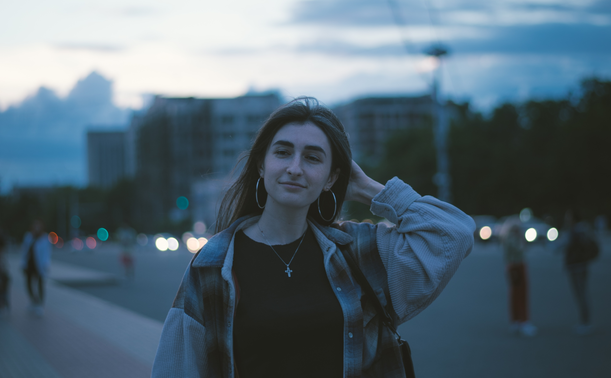

# Emilia here 👋

## About me

I am 27 years old, although I still feel young 🫣

It's been 2 years since I call Brussels _my home_.

I became interested in Front-end because I have had human interaction for too long which was tiring me and I just want to move on being _introverted_ for a while. I have always had a passion about computer and self-learned a lot of things.

### Hobbies

- Trying new foods in new countries
- Eating
- Singing
- Cooking, but only the things I like
- Walking
- Watching movies

### Languages

- Romanian - native
- English - fluent
- Russian - fluent
- Italian - conversational
- French - conversational

### Pet peeve

- I can listen to a song on repeat for days, or, if I like it too much, for
weeks
<!--
**emilia-12/emilia-12** is a ✨ _special_ ✨ repository because its `README.md` (this file) appears on your GitHub profile.

Here are some ideas to get you started:

- 🔭 I’m currently working on ...
- 🌱 I’m currently learning ...
- 👯 I’m looking to collaborate on ...
- 🤔 I’m looking for help with ...
- 💬 Ask me about ...
- 📫 How to reach me: ...
- 😄 Pronouns: ...
- ⚡ Fun fact: ...
  -->
